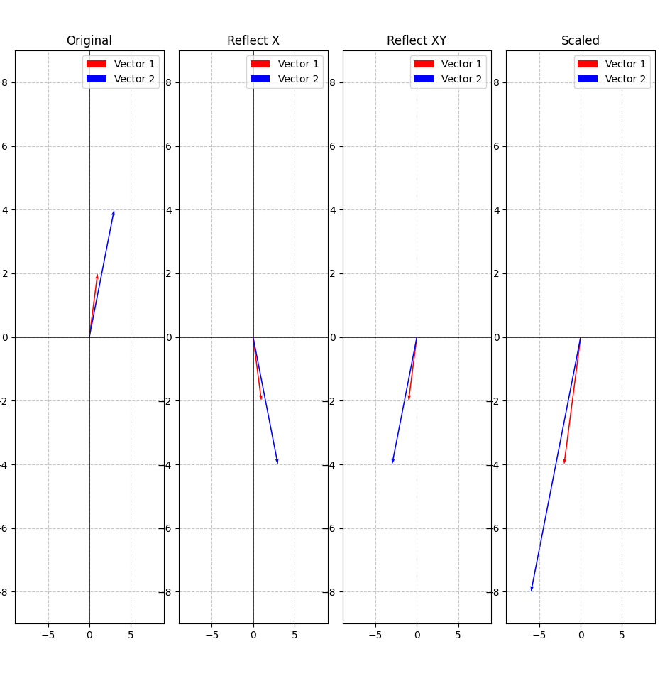

# LinearVisualizer : Visualizing linear Transformation.

This tiny library is just for practice purpose where I tried to do some linear transformations, it has sheering, scaling as well as reflection feature.

I have also added a function here that help to visualize all of the vector in a graph side by side for comparison.
Here is an example of that

If you have any idea on what I should add in here feel free to let me know as well as you are welcome to fork and play with it as well

Cheers.....!!!!!
